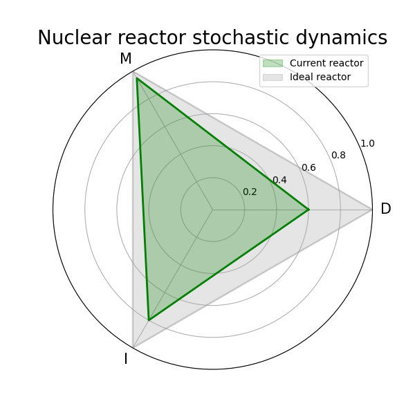
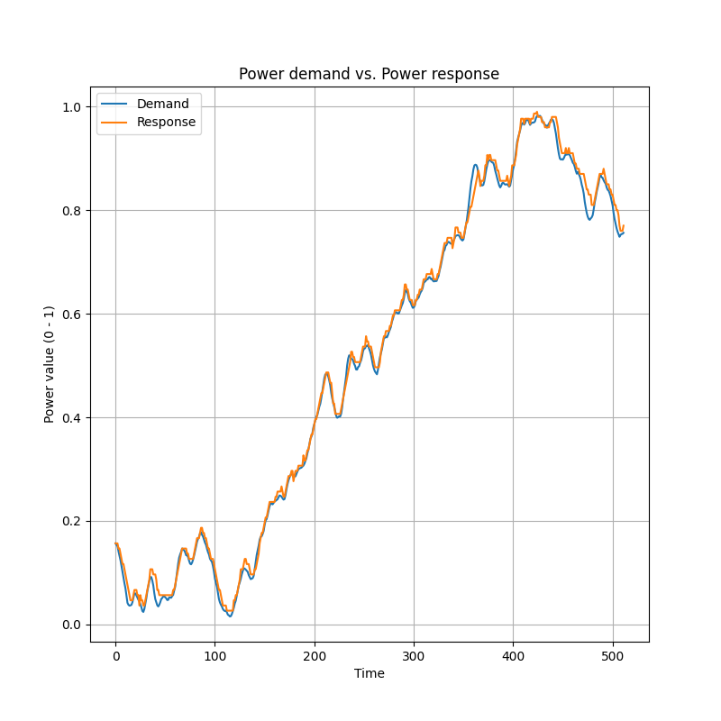

# Control of a Nuclear Reactor Under Uncertainty

Python project that stochastically models the behaviour of a nuclear reactor under uncertainty, controlling its power output through the use of an MDP (Markov Decision Process).

A reactor's power is expected to match the demand as closely as possible, and at any point in time a reactor can only perform one of three given actions (decrease `"d"`, maintain `"m"` or increase `"i"` power). However, there is a chance that the desired action does not produce the expected result. This uncertainty is handled through an MDP that allows learning the optimal policy (best action) to be carried for each state and adapt its response accordingly.

## Features 

- MDP modelling
  - Parsing of the reactor data file
  - Random generation of the reactor's energy demand curve
  - Generation of the transition matrices from the reactor probabilities
  - Generation of the cost matrix at each point of the demand curve

- MDP execution
  - Computation of the optimal policy via iteratively solving Bellman's optimality equations
  - Finds the best possible action for the current state according to the learned policy
  - Stochastic modelling of the outcome of the chosen action
  - Updates the reactor's response accordingly
 
- Visualization of the simulation results

<p align="center">
  
    &nbsp;&nbsp;&nbsp;&nbsp;&nbsp;&nbsp;&nbsp;&nbsp;
  
</p>

<p align="center">
  <em>
    Figure 1. Nuclear reactor stochastic dynamics.
    &nbsp;&nbsp;&nbsp;&nbsp;&nbsp;&nbsp;&nbsp;&nbsp;    
    &nbsp;&nbsp;&nbsp;&nbsp;&nbsp;&nbsp;&nbsp;&nbsp;
    &nbsp;&nbsp;&nbsp;&nbsp;&nbsp;&nbsp;&nbsp;&nbsp;
    Figure 2. Power demand vs. Power response.
  </em>
</p>

- Evaluation metrics to assess the MDP
  - MAE and MSE to measure the error between requested power and actual output
  - $R^{2}$ and Pearson correlation to measure the similarity between demand and response

## How to run

First, make sure you have  `Python 3.10+` installed and install the required dependencies. To do so, run

  ```
pip install numpy matplotlib pymdptoolbox
  ```

Then, clone the repository and navigate into it in the terminal
  ```
git clone https://github.com/dgarcl/AI-Final-Project
cd AI-Final-Project
  ```

Finally, to run the project use the following command: 
```
python main.py --i <input-reactor> --g <gamma> --r <random-seed>
```
where `input-reactor` is the path to a reactor JSON file, `gamma` is the MDP discount factor and `random-seed` is a seed used for reproducibility.

## Authors

This project was developed in collaboration with [100551049-ctrl](https://github.com/100551049-ctrl) and [100526369](https://github.com/100526369) for academic purposes. 
